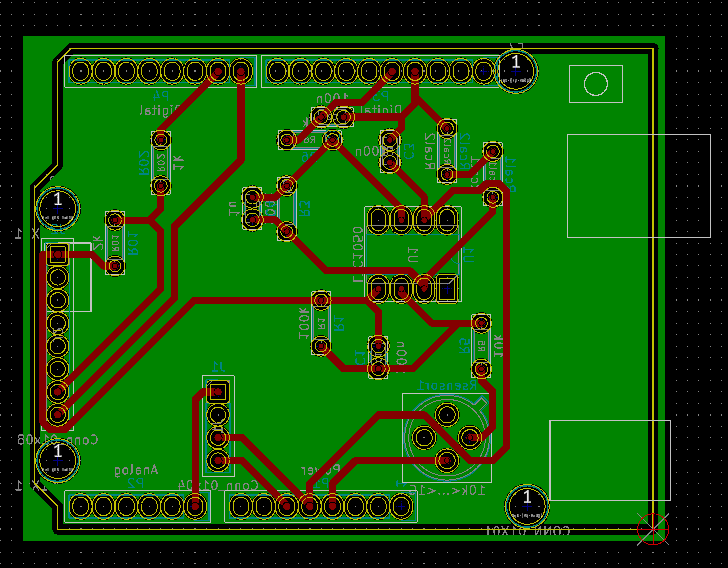
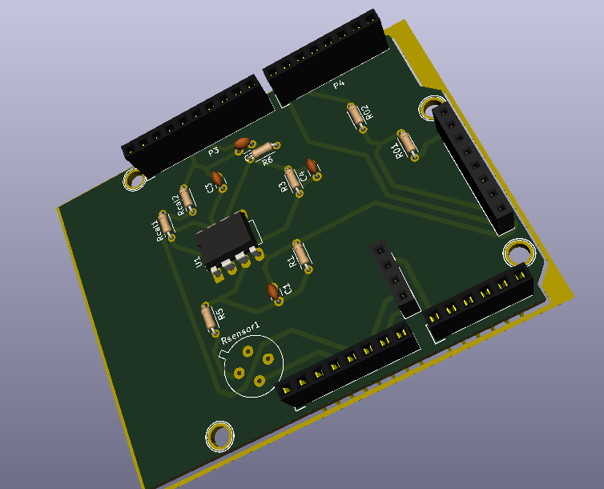

# Connected gas sensor / LoRa TTN
Project 5th ISS - MOSH - TP Gas Sensor
Authors: MOULINIÉ Dorian & YU Juan from INSA Toulouse - 5 ISS

# Description

This main goal of this project is to build a connected nanoparticle gas sensor to monitor the concentration of gas.

For this, we used an Arduino UNO and RN2483 LoRa chip to send data on the The Things Network.

We used Kicad for building this shield. Because it is an Open Source Electronics Design Automation Suite. We are able to use  the Schematic Capture and the PCB Layout along with the 3D Viewer in it. They can help us have a more specific view of our shield.

# Content

a KiCad project manage file

KiCad Schematic files

KiCad PCB Files: A shield for the gas sensor and the LoRa Module to plug in an Arduino Uno

KiCad Libraries

Pictures of the components

Readme file

## Overview

This shield is composed of:

 - a LoRa Module (RN2483) as transceiver
 - a Gas sensor
 - an amplifier (LTC1050)
 - a Groove connector for future calibration of the Gas Sensor

First, we created the project with an arduino UNO

Then, we created a library symbol for LTC 1050

Afterwards, we created the following circuit : 

### PCB

In order to add the gas sensor to the board, we first created an new footprint. 

After we had all the components prepared, we started to do the routage.

